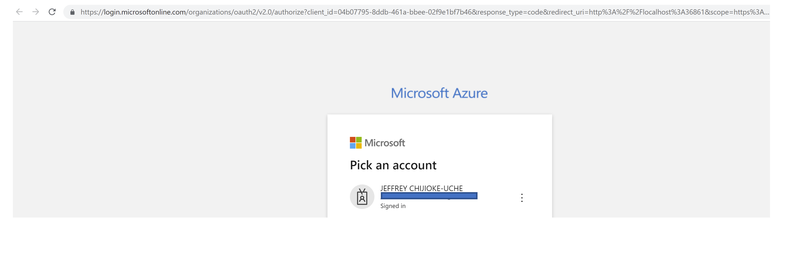
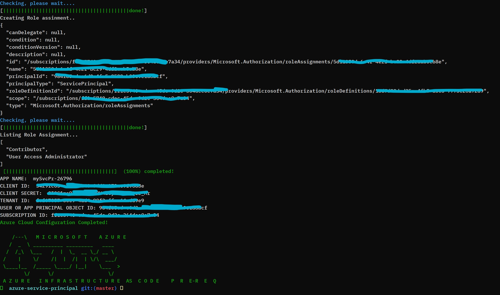

## Configure Azure Service Principal

Azure has a notion of a Service Principal which, in simple terms, is a service account. This doc will demonstrate how to set up an Azure service principal that can be used to execute Azure resources

### Service principal privileges
In order to build your Azure environment using a service principal, the following are the minimal requirements:

- Subscription built-in roles, Contributor, and User Access Administrator.
- Active Directory built-in application admin role;Cloud Application Administrator.
- Active Directory Graph API permission: Application.ReadWrite.All.

All these will be created automatically when you run this script.

### Guide:

 - If you are using a local terminal, prior to executing the script, in the local terminal you are required to log into Azure (az login) with an ID that has the necessary privileges (i.e. Owner). To do this, run the script and you will be asked if you need to login to your Azure account. If you answer Yes(Y), you will be prompted via your default browser to sign in. Once signed in, you will close the browser and return to the terminal.

 - If you are using Bash in Azure cloud shell, there is no need to login (az account show). In this case, you will answer No(N) and the process will continue. Take caution not to lose the bash session in the Azure portal web page. The Azure will terminate the session if you close the browser when using this option.

 ------

 ### Use
  ```bash
  Step-1:  
  git clone https://github.ibm.com/IBM-Azure/azure-service-principal.git

  Step-2:
  cd azure-service-principal

  Step-3:
  bash azure-service-principal.sh
  ```

 ### Author
 - Jeffrey Chijioke-Uche  (Sr. Cloud Solution Architect)
 - Company: IBM
 
 ### Snapshot
 <h2 align="center">
  
</h2>
 <h2 align="center">
  
</h2>
 <h2 align="center">
  
</h2>
 <h2 align="center">
  
</h2>